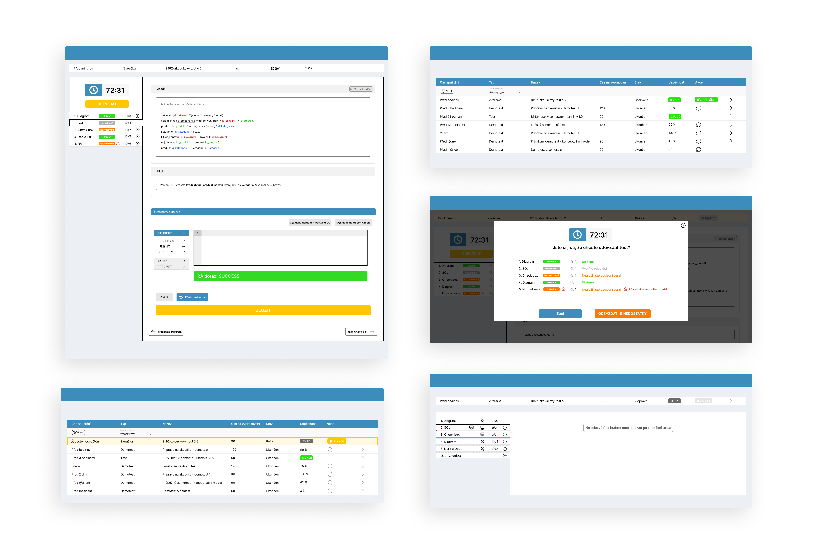
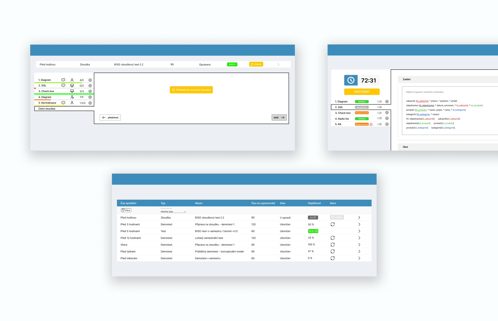

# Bachelor-Thesis
V tomto souboru naleznete popis obsahu bakalářské práce **dbs.fit.cvut.cz - frontend pro studenty**.

Projekt portálu DBS je soukromý projekt Českého učení vysokého v Praze a nemůže být zveřejněn široké veřejnosti, a proto nemohou být přiloženy zdrojové kódy.
Zde jsou odkazy na uzavřené repozitáře a jiné odkazy z výstupu práce.

* Repozitář s implementací studentských testů: [https://gitlab.fit.cvut.cz/dbs/dbs-frontend/-/tree/BP_suchodan_student_tests](https://gitlab.fit.cvut.cz/dbs/dbs-frontend/-/tree/BP_suchodan_student_tests)
* Repozitář s dokumentací: [https://gitlab.fit.cvut.cz/dbs/dokumentace-fe](https://gitlab.fit.cvut.cz/dbs/dokumentace-fe)
* Odkaz na dokumentaci: [https://dbs.pages.fit/dokumentace-fe/](https://dbs.pages.fit/dokumentace-fe/)
* Odkaz na návrhy ve Figmě: [https://www.figma.com/file/rjbyv2t9HdAaBuL6oOZsU1/Psan%C3%AD-test%C5%AF?type=design&node-id=278%3A6835&t=PJ8EKmZMDMGpafI3-1](https://www.figma.com/file/rjbyv2t9HdAaBuL6oOZsU1/Psan%C3%AD-test%C5%AF?type=design&node-id=278%3A6835&t=PJ8EKmZMDMGpafI3-1)
* Odkaz na text Bakalářeské práce a posudky: [https://dspace.cvut.cz/handle/10467/109397](https://dspace.cvut.cz/handle/10467/109397)

## Struktura

```
.
├─ designIllustration/             ukázky wireframů z README.md
│   ├─ designIllustration1.png     
│   └─ designIllustration1.png               
├─ text/    
│   ├─ BPsuchodan.pdf              text práce ve formátu PDF 
│   └─ BPsuchodan.zip              text práce ve formátu ZIP 
├─ wireframes/                     wireframy 
│   ├─ navrhyStare.pdf             exportované návrhy z Figmy (starší verze) 
│   └─ navrhyNove.pdf              exportované návrhy z Figmy (novější verze) 
└─ readme.md                       

```

## Ukázka wireframů


